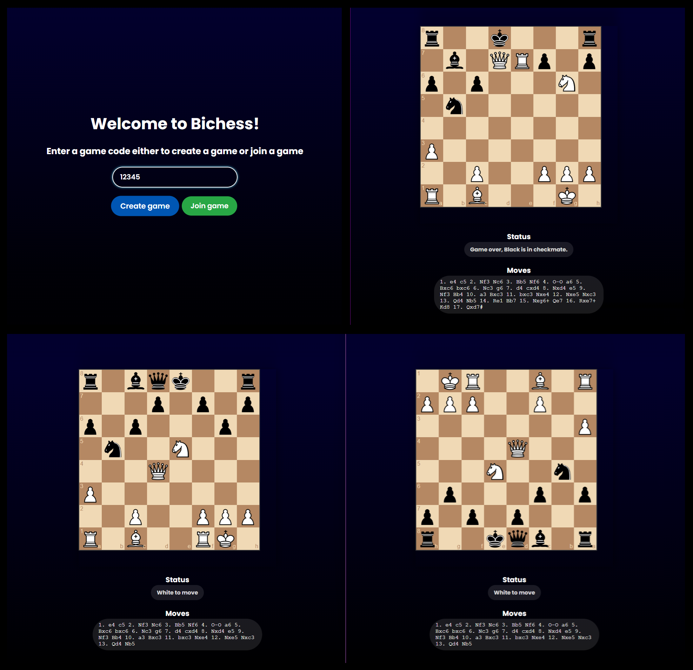

# Bichess

**Bichess** is a real-time online chess game that utilizes **Socket.IO** for real-time communication between players. The server-side logic is powered by **Express.js**, while the user interface is built using plain **HTML**, **CSS**, and **JavaScript**. This combination ensures a responsive and interactive chess experience for users.



## Features

- **Real-time Multiplayer:** Play chess against another player in real-time.
- **Room System:** Create or join a game room with a unique game code.
- **Interactive Chessboard:** Drag-and-drop functionality for moving pieces.
- **Game Status and PGN:** View the current status of the game and the Portable Game Notation (PGN) of the moves.

## Installation and Setup

1. **Clone the Repository:**

   ```bash
   git clone https://github.com/CAPELLAX02/Bichess.git
   cd bichess
   ```

2. **Install Dependencies::**

   ```bash
    npm install
   ```

3. **Run the Server:**

   ```bash
   node index.js
   ```

4. **Access the Game:**
   - Open your web browser and navigate to http://localhost:3000.

## How to Play

### 1. Create a Game:

- Enter a unique game code and click on the "Create game" button. You will be assigned the white pieces.

### 2. Join a Game:

- Enter the same game code as the second player on the second browser session and click on the "Join game" button. You will be assigned the black pieces.

### 3. Play Chess:

- The game will start as soon as both players have joined the room. Move your pieces by dragging and dropping them on the desired squares.
